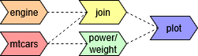

<!-- README.md is generated from README.Rmd. Please edit that file -->

```{r, include = FALSE}
knitr::opts_chunk$set(
  collapse = TRUE,
  comment = "#>",
  fig.path = "man/figures/README-",
  out.width = "100%"
)
```

# xafty

<!-- badges: start -->
[](https://github.com/davidcrone/xafty/actions/workflows/R-CMD-check.yaml)

[](LICENSE)
<!-- badges: end -->

Turn your R data pipelines into a scalable and collaborative network graph.

## What It Does

**xafty** turns your data pipeline into a dependency graph instead of a linear script. Each step becomes a reusable node that declares what it needs and what it provides. xafty resolves the execution order for you, enables reuse across projects, and hides complexity behind clean layers of abstraction.

## Why It Matters

Most data pipelines are built as one-off scripts: hard to reuse, fragile to change, and difficult for teams to collaborate on. As projects grow, this leads to duplicated logic, inconsistent results, and a constant need to rebuild work that already exists.

xafty solves this by treating every transformation as a reusable node in a shared dependency graph. Instead of rewriting the same steps for every new project, teams compose pipelines from existing, validated building blocks. This makes data work more reliable, more maintainable, and far easier to extend over time.

## Key Advantages

- **High flexibility with no overhead:** Since each node is just a function from data.frame → data.frame, you don’t have to adopt a new data model or rewrite existing logic. Existing code drops directly into the network with minimal changes.
- **Reduced cognitive burden:** You don’t need to remember the correct sequence of function calls. Colleagues can retrieve the data they need without studying the entire pipeline. They simply query the variables, and xafty evaluates the required steps.
- **Effortless extensibility:** Adding a new step is as simple as:
  1. deciding which variables it needs,
  2. writing a function that takes and returns a data.frame,
  3. registering it in the network.
- **Effortless collaboration:** Networks invite contribution. Dropping in a new node is simple and low-risk, unlike pipelines where every change risks breaking the flow.

## Installation

``` r
 pak::pkg_install("davidcrone/xafty")
```

## Basic Concept


Let's understand the idea behind xafty by going step by step from a simple script to a network pipeline.

- [Step 1: Stateful Pipeline](#step-1-stateful-pipeline)
- [Step 2: Functional Pipeline](#step-2-functional-pipeline)
- [Step 3: Network Pipeline](#step-3-network-pipeline)

### Step 1: Stateful Pipeline


Probably everyone starting off with data analytics has written a data pipeline that looked similar to the following:

``` r
# 1. Load data
data("mtcars")

# 2. Add derived variable
mtcars$power_to_weight <- mtcars$hp / mtcars$wt

# 3. Get engine lookup table
engine <- data.frame(
  type = as.factor(c("Straight", "V-Shape")),
  vs = c(1, 0)
)

# 4. Join everything together
mtcars <- merge(mtcars, engine, by = "vs", all.x = TRUE, sort = FALSE)

# 5. Use results
plot(mtcars$type, mtcars$power_to_weight)

```
This is a good start. It gets to the point, fast and comprehensible. But as your codebase and use-cases grow, several problems emerge:

- **Hard to reuse:** Scripts are linear and stateful. If you or a colleague want only part of the logic, you need to copy-paste code and manually recreate upstream context. This often breaks because steps depend on hidden side effects or object states.
- **Difficult to scale:** As the script grows, earlier steps become tightly coupled to later ones. Small changes upstream can unintentionally cascade downstream, making the pipeline fragile and harder to extend.
- **Locked to one use-case:** A linear script encodes a single way to run the pipeline. If you later need different subsets of the data, alternative derivations, or multiple outputs, the entire script must be restructured or duplicated.

### Step 2: Functional Pipeline


We can address many of the shortcomings of such a stateful script, by writing everything as a function:

``` r
get_mtcars <- function() {
  data("mtcars", envir = environment())
  mtcars
}

add_power_to_weight <- function(mtcars) {
  mtcars$power_to_weight <- mtcars$hp / mtcars$wt
  mtcars
}

get_engine_details <- function() {
  engine <- data.frame(
    type = as.factor(c("Straight", "V-Shape")),
    vs = c(1, 0)
  )
  engine
}

join_engine_details <- function(mtcars, engine) {
  joined <- merge(mtcars, engine, all.x = TRUE, sort = FALSE)
  joined
}

plot_mtcars <- function(mtcars) {
 mtcars_plot <- plot(mtcars$type, mtcars$power_to_weight)
 mtcars_plot
}

# Assemble the pipeline
mtcars_plot <- function() {
 mtcars <- get_mtcars()
 engine <- get_engine_details()
 
 mtcars <- join_engine_details(mtcars = mtcars, engine = engine)
 mtcars <- add_power_to_weight(mtcars = mtcars)
 
 plot_mtcars(mtcars = mtcars)
}

# Run the pipeline
mtcars_plot()

```
This is already a major improvement. The modular structure makes the pipeline composable, testable, reusable, and much easier to understand. While this approach modularizes the logic, it still needs to be assembled manually:

- **Implicit dependency chains:** Each function still relies on being called in the correct order. Dependencies remain implicit in the code flow, so the pipeline can break if someone rearranges or reuses functions without fully understanding upstream assumptions.
- **Limited flexibility for different outputs:** If you need to return a slightly different subset of the data, or produce multiple alternative outputs, you end up copying, commenting out or branching some of the functions. The pipeline becomes a tangle of custom assembly code instead of a reusable structure.
- **Difficult to reason about impact:** If a function is modified, there is no built-in way to ask: Which parts of the pipeline rely on this? What might this change affect? Understanding ripple effects becomes a manual and error-prone process.

### Step 3: Network Pipeline



Moving from a functional pipeline to a network pipeline is the final step in making our code fully declarative, flexible, and scalable. 

We **reuse the functions from [step 2](#step-2-functional-pipeline)** and express them as a xafty network:

``` r
## Preparation: 
# Make sure that the functions from step 2 are loaded into memory.
## /Preparation

library(xafty)

# Initialize the network with the desired structure
xafty_network <- init_network("example_network", projects = c("mtcars", "engine"))

## Register the functions in project "mtcars" ##

# The function `get_mtcars()` is registered as a root node in the project "mtcars".
xafty_network$mtcars$get(get_mtcars())

# Instead of passing data to `add_power_to_weight`, we register a dependency using query()
xafty_network$mtcars$add(add_power_to_weight(mtcars = query(mtcars = c("hp", "wt"))))

## Register the function `get_engine_details()` in project "engine" ##
xafty_network$engine$get(get_engine_details())

# Finally, we register the join between the two projects, 
# by passing two separate queries to the respective parameters
xafty_network$mtcars$join(join_engine_details(mtcars = query(mtcars = "vs"),
                                              engine = query(engine = "vs")))

# Inspect the network
xafty_network

# Pull data as needed from the network in the desired column order
xafty_network |> nascent(mtcars = c("hp", "wt", "vs"), 
                         engine = "type", 
                         mtcars = "power_to_weight")

```
In xafty, each function from step 2 becomes a node in the network. Instead of passing data to each function, we use `xafty::query()` to declare which input variables are needed. 

In order to retrieve data from the network, we simply tell `xafty::nascent()` which variables we want. 

xafty then 
1. walks the graph, 
2. resolves the required nodes in topological order, 
3. and returns a single data.frame containing precisely what you asked for.

For example, if we use the above network to query the following variables:

``` r
xafty_network |> nascent(mtcars = c("hp"), engine = "type")
```
**The resulting pipeline can be represented as follows:**


➜ Pipelines are no longer assembled manually. You simply query the data you need and let the system do the orchestration.

Finally, to add the original plot to the network, we now need to use "objects":

``` r
# This is how you would add the plot as a finished data product to the network:
xafty_network$mtcars$add_object("mtcars_plot", 
                                plot_mtcars(mtcars = query(engine = "type", mtcars = "power_to_weight")))
```
To retrieve an object from a network, we query the network as follows:

``` r
# To query an object from the network, we must write the object's name in squared brackets
xafty_network |> nascent(mtcars = "[mtcars_plot]")
```

This assembles our original pipeline, we have already seen in step 2


This highlights another key advantage: 

➜ In network pipelines, intermediate steps are just as accessible as the final data product. This makes it easy to “branch off” from these intermediate steps and reuse them, rather than starting from a blank slate, as is common in many data analytics projects.

## Additional Features

While **xafty is still in active development**, you will find it already being quite feature rich:

- Programming with `{states}`, passed alongside queries via `xafty::with_state()`.
- Context on entry/exit for each project, similar to `dplyr::group_by() / ungroup()`, enabling wrapping for lossless transformations.
- Wildcard selection with `xafty::query(project = "*")` to request all variables from a project.
- Inspection tools, such as `xafty::build_dag()`, to view the internal dependency graph.

## Ideas for Future Enhancements

Network-based pipelines open the door to many extensions and integrations. Below is an overview of both the near-term roadmap and more ambitious directions.

### Core Features

Version 1.0 aims to make xafty a practical solution for ~95% of everyday data-pipeline workflows. To reach that milestone, several essential features still need to be implemented:

- **Support for lossy transformations** (e.g., `dplyr::group_by() / summarise()`), integrated seamlessly into a network structure
- **A flexible filtering mechanism** using a `where()` clause, providing fine-grained control over when filtering is applied
- **Developer tooling**, such as visualizations and printable summaries of network components, to make building with xafty easier
- **Robust testing and bug fixing** to ensure reliability at scale

### Visionary Features

Beyond the core roadmap, xafty can evolve into a powerful component within existing analytic ecosystems:

- **Integration with {targets}:** A DAG created via xafty::build_dag() could be translated directly into a {targets} pipeline, unlocking caching, parallel processing, and full reproducibility
- **Interoperability with DuckDB and Arrow:** Allowing nodes backed by SQL or Python would enable cross-language collaboration and high-performance hybrid networks

## Get Involved

**xafty** is in active development, and your feedback is incredibly valuable!

If you're curious, testing it out, have ideas to improve it, or want me to prioritize a feature [get in touch](mailto:davidjvcrone@gmail.com) or 
[open an issue](https://github.com/davidcrone/xafty/issues). Whether it’s bugs, feature requests, or just to chat, I’d love to hear from you! :)
